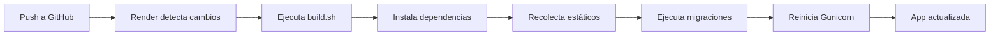

# 🚀 EcoFact - Despliegue en Render

[](https://render.com)

## 🌐 Aplicación Desplegada

**URL Producción**: `https://[tu-app].onrender.com`

---

## 📋 Descripción

EcoFact es un sistema completo de gestión de facturas con:
- 🔐 Sistema de autenticación robusto (admin, vendedor, cliente)
- 📦 Gestión de inventario de productos
- 🧾 Creación y gestión de facturas
- 📊 QR codes para facturas
- 📧 Sistema de recuperación de contraseñas por email
- 🎨 Interfaz moderna y responsiva

---

## 🛠️ Tecnologías

- **Backend**: Django 5.2.4
- **Base de Datos**: PostgreSQL
- **Servidor**: Gunicorn
- **Archivos Estáticos**: WhiteNoise
- **Email**: SMTP (Gmail)
- **Hosting**: Render (Web Service + PostgreSQL)

---

## 📦 Dependencias Principales

```
Django==5.2.4
gunicorn==23.0.0
whitenoise==6.8.2
dj-database-url==2.3.0
psycopg2-binary==2.9.10
python-decouple==3.8
pillow==11.3.0
reportlab==4.4.4
qrcode==8.2
```

---

## 🚀 Despliegue Rápido

### 1. Clonar el repositorio
```bash
git clone https://github.com/Infona2049/Proyecto.git
cd Proyecto
```

### 2. Conectar con Render

#### Opción A: Blueprint (Recomendado)
1. Ve a [Render Dashboard](https://dashboard.render.com/)
2. Click en **"New +"** → **"Blueprint"**
3. Conecta este repositorio
4. Render detectará automáticamente `render.yaml`
5. Configura las variables de entorno de email
6. Click en **"Apply"**

#### Opción B: Manual
1. Crea un nuevo **Web Service**
2. Conecta el repositorio
3. Configura:
   - **Build Command**: `./build.sh`
   - **Start Command**: `gunicorn EcoFactProject.wsgi:application`
   - **Environment**: Python 3
4. Agrega una base de datos PostgreSQL
5. Configura variables de entorno (ver abajo)

### 3. Variables de Entorno Requeridas

```env
# Django
SECRET_KEY=<generado automáticamente por Render>
DEBUG=False
ALLOWED_HOSTS=<tu-app>.onrender.com

# Base de Datos
DATABASE_URL=<generado automáticamente por Render>
USE_POSTGRESQL=True

# Email (Gmail)
EMAIL_BACKEND=django.core.mail.backends.smtp.EmailBackend
EMAIL_HOST=smtp.gmail.com
EMAIL_HOST_USER=tu-email@gmail.com
EMAIL_HOST_PASSWORD=tu-app-password
EMAIL_PORT=587
EMAIL_USE_TLS=True
DEFAULT_FROM_EMAIL=tu-email@gmail.com
```

### 4. Después del Despliegue

Accede al Shell de Render y ejecuta:

```bash
# Crear superusuario
python manage.py createsuperuser

# O crear usuarios de prueba
python manage.py create_test_users
```

---

## 🏗️ Arquitectura del Despliegue

```
┌─────────────────────────────────────┐
│         Render Platform             │
│                                     │
│  ┌─────────────────────────────┐   │
│  │   Web Service               │   │
│  │   • Django App              │   │
│  │   • Gunicorn Server         │   │
│  │   • WhiteNoise (Static)     │   │
│  │   • Python 3.11             │   │
│  │   • Plan: Free              │   │
│  └──────────┬──────────────────┘   │
│             │                       │
│             │ DATABASE_URL          │
│             ▼                       │
│  ┌─────────────────────────────┐   │
│  │   PostgreSQL Database       │   │
│  │   • 256 MB Storage          │   │
│  │   • Automated Backups       │   │
│  │   • Plan: Free              │   │
│  └─────────────────────────────┘   │
│                                     │
└─────────────────────────────────────┘
            │
            │ HTTPS
            ▼
       👥 Usuarios
```

---

## 📁 Estructura del Proyecto

```
Proyecto/
├── 🔧 build.sh                    # Script de construcción para Render
├── 📋 render.yaml                 # Configuración Blueprint
├── 📝 requirements.txt            # Dependencias Python
├── 🔐 .env.example                # Plantilla de variables de entorno
├── 🚫 .gitignore                  # Archivos excluidos de Git
│
├── 📚 Documentación/
│   ├── DESPLIEGUE_RENDER.md       # Guía completa de despliegue
│   ├── RESUMEN_DESPLIEGUE.md      # Resumen rápido
│   ├── CHECKLIST_DESPLIEGUE.md    # Checklist paso a paso
│   └── COMANDOS_RENDER.md         # Comandos útiles
│
├── ⚙️ EcoFactProject/             # Configuración Django
│   ├── settings.py                # Settings para producción
│   ├── urls.py
│   └── wsgi.py
│
├── 👤 core/                       # App principal (usuarios)
│   ├── models.py                  # Modelo Usuario personalizado
│   ├── views.py                   # Login, registro, etc.
│   ├── forms.py                   # Formularios
│   └── middleware.py              # Middleware de roles
│
├── 📦 productos/                  # App de productos
│   ├── models.py                  # Modelo Producto
│   ├── views.py                   # CRUD productos
│   └── forms.py
│
└── 🧾 facturas/                   # App de facturas
    ├── models.py                  # Modelos Factura y DetalleFactura
    ├── views.py                   # Crear, ver, imprimir facturas
    └── services.py                # Lógica de negocio
```

---

## 🔄 Flujo de Despliegue Automático



1. Haces `git push` a la rama `main`
2. Render detecta el cambio automáticamente
3. Ejecuta `build.sh`:
   - Instala dependencias de `requirements.txt`
   - Recolecta archivos estáticos con `collectstatic`
   - Ejecuta migraciones de base de datos
4. Reinicia el servidor Gunicorn
5. La aplicación se actualiza sin intervención manual

---

## 👥 Usuarios por Defecto

Después de ejecutar `python manage.py create_test_users`:

| Usuario      | Contraseña | Rol       |
|--------------|------------|-----------|
| admin        | admin123   | Admin     |
| vendedor     | vendedor123| Vendedor  |
| cliente      | cliente123 | Cliente   |
| superadmin   | super123   | SuperAdmin|

⚠️ **Importante**: Cambia estas contraseñas en producción.

---

## 🔒 Seguridad

### Implementado:
- ✅ SECRET_KEY único y generado automáticamente
- ✅ DEBUG=False en producción
- ✅ ALLOWED_HOSTS configurado dinámicamente
- ✅ HTTPS automático (proporcionado por Render)
- ✅ Contraseñas hasheadas con PBKDF2
- ✅ Protección CSRF
- ✅ Middleware de seguridad de Django
- ✅ Variables sensibles en variables de entorno (no en código)

### Recomendaciones:
- 🔐 Usa contraseñas fuertes para superusuarios
- 📧 Activa autenticación de dos factores en Gmail
- 🔑 Usa App Passwords de Gmail (no contraseña real)
- 🔄 Rota SECRET_KEY periódicamente
- 📊 Monitorea logs regularmente

---

## 📊 Monitoreo y Logs

### Ver Logs en Tiempo Real
1. Dashboard de Render → Tu servicio
2. Click en **"Logs"** en el menú lateral
3. Filtra por:
   - `ERROR` - Errores críticos
   - `WARNING` - Advertencias
   - `INFO` - Información general

### Métricas Disponibles
- **CPU Usage**: Uso de CPU
- **Memory Usage**: Uso de memoria RAM
- **Response Time**: Tiempo de respuesta
- **Request Count**: Número de peticiones

---

## 🐛 Solución de Problemas

### App no inicia
```bash
# Ver logs completos
# Dashboard → Logs

# Verificar que build.sh se ejecutó
# Debería mostrar:
# ✓ Collecting static files...
# ✓ Running migrations...
# ✓ Starting gunicorn...
```

### Archivos estáticos no cargan
```bash
# En el Shell de Render:
python manage.py collectstatic --no-input

# Verificar configuración:
python manage.py shell
>>> from django.conf import settings
>>> print(settings.STATIC_ROOT)
```

### Error de base de datos
```bash
# Verificar DATABASE_URL
python manage.py shell
>>> import os
>>> print(os.environ.get('DATABASE_URL')[:50])

# Verificar conexión
>>> from django.db import connection
>>> connection.ensure_connection()
```

### Emails no se envían
```bash
# Verificar configuración de email
python manage.py shell
>>> from django.conf import settings
>>> print(f"Host: {settings.EMAIL_HOST}")
>>> print(f"Port: {settings.EMAIL_PORT}")
>>> print(f"User: {settings.EMAIL_HOST_USER}")

# Probar envío
>>> from django.core.mail import send_mail
>>> send_mail('Test', 'Mensaje', settings.DEFAULT_FROM_EMAIL, ['test@test.com'])
```

---

## 📚 Documentación Adicional

- 📖 [Guía Completa de Despliegue](DESPLIEGUE_RENDER.md)
- ✅ [Checklist de Despliegue](CHECKLIST_DESPLIEGUE.md)
- 🔧 [Comandos Útiles](COMANDOS_RENDER.md)
- 📝 [Resumen Rápido](RESUMEN_DESPLIEGUE.md)
- 🔐 [Sistema de Autenticación](SISTEMA_AUTENTICACION_IMPLEMENTADO.md)

---

## 🤝 Contribuir

1. Fork el proyecto
2. Crea una rama para tu feature (`git checkout -b feature/AmazingFeature`)
3. Commit tus cambios (`git commit -m 'Add AmazingFeature'`)
4. Push a la rama (`git push origin feature/AmazingFeature`)
5. Abre un Pull Request

---

## 📝 Licencia

Este proyecto es privado y de uso educativo.

---

## 👨‍💻 Equipo

- **Repositorio**: [Infona2049/Proyecto](https://github.com/Infona2049/Proyecto)
- **Contacto**: ecofactproyect@gmail.com

---

## 🎉 Estado del Despliegue


---

## 📞 Soporte

¿Problemas con el despliegue?

1. Revisa la [Guía de Despliegue](DESPLIEGUE_RENDER.md)
2. Consulta la [Solución de Problemas](#-solución-de-problemas)
3. Revisa los logs en el Dashboard de Render
4. Abre un issue en GitHub

---

**✨ ¡Listo para desplegar en Render!** ✨
